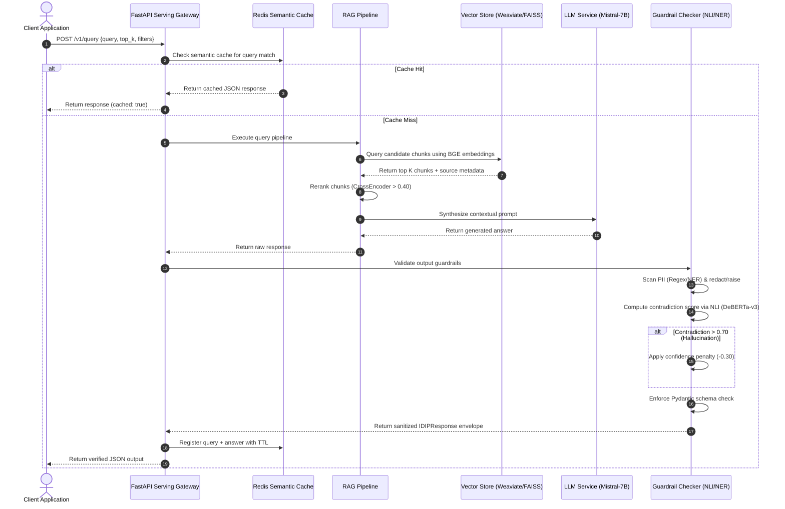

# <p align="center">██████╗ ██████╗  ██████╗██████╗<br>╚════██╗██╔══██╗ ╚════██╗██╔══██╗<br> █████╔╝██║  ██║  █████╔╝██████╔╝<br> ╚═══██╗██║  ██║  ╚═══██╗██╔═══╝<br>██████╔╝██████╔╝ ██████╔╝██║<br>╚═════╝ ╚═════╝  ╚═════╝ ╚═╝</p>

# Intelligent Document Intelligence Platform (IDIP)

[](https://www.python.org/)
[](https://fastapi.tiangolo.com/)
[](https://react.dev/)
[](https://www.docker.com/)
[](https://python-poetry.org/)
[](https://mlflow.org/)
[](https://dvc.org/)
[](https://www.postgresql.org/)
[](https://redis.io/)
[](https://kafka.apache.org/)

IDIP (Intelligent Document Intelligence Platform) is an enterprise-grade, high-performance RAG and document intelligence platform designed to handle document ingestion, quality-gate validation, features computation, vector indexing, multi-model parallel inference routing, ensembling, guardrail execution, and automated drift-based retraining loops.

---

## 📖 Table of Contents

- [1. Subsystems & Architecture](#1-subsystems--architecture)
- [2. System Flow Diagram](#2-system-flow-diagram)
- [3. Subsystems In Detail](#3-subsystems-in-detail)
  - [Ingestion Subsystem](#ingestion-subsystem)
  - [Preprocessing & Feature Store](#preprocessing--feature-store)
  - [Model Routing & Ensemble Subsystem](#model-routing--ensemble-subsystem)
  - [Guardrails Layer](#guardrails-layer)
  - [MLOps Subsystem](#mlops-subsystem)
  - [Monitoring & Observability](#monitoring--observability)
- [4. Technology Stack & Dependencies](#4-technology-stack--dependencies)
- [5. System Directory Layout](#5-system-directory-layout)
- [6. Configuration & Tuning Parameters](#6-configuration--tuning-parameters)
- [7. Getting Started](#7-getting-started)
  - [Prerequisites](#prerequisites)
  - [Local Installation](#local-installation)
  - [Running the Application](#running-the-application)
  - [Makefile Reference](#makefile-reference)
- [8. Production API Endpoints Reference](#8-production-api-endpoints-reference)
- [9. Infrastructure & DevOps Setup](#9-infrastructure--devops-setup)
- [10. Verification & Test Suite](#10-verification--test-suite)

---

## 1. Subsystems & Architecture

IDIP is structured into several modular layers that handle different stages of the document lifecycle:

```
┌──────────────────────────────────────────────────────────────────────────────┐
│                             API Gateway & CORS                               │
└──────────────────────────────────────┬───────────────────────────────────────┘
                                       │ (FASTAPI)
┌──────────────────────────────────────▼───────────────────────────────────────┐
│                               Ingestion Layer                                │
│   - Multi-format Adapters (PDF, Images, Database, Stream, REST APIs)         │
│   - Great Expectations Validation & Schema Quality Gates                     │
│   - Redis SHA-256 Duplication Filtering & Dead Letter Queue Routing          │
└──────────────────────────────────────┬───────────────────────────────────────┘
                                       │ (CELERY ASYNC WORKERS)
┌──────────────────────────────────────▼───────────────────────────────────────┐
│                           Preprocessing Pipeline                             │
│   - Text Cleaning and Multi-Strategy Chunking (Fixed, Semantic, Window)      │
│   - SQL Feature Store Logging (Readability, Density, Quality, Page Counts)   │
│   - BGE Embedding Encoding and Upserts (FAISS / Pinecone / Weaviate)          │
└──────────────────────────────────────┬───────────────────────────────────────┘
                                       │ (INFERENCE ROUTING)
┌──────────────────────────────────────▼───────────────────────────────────────┐
│                         Parallel Inference Router                            │
│   - Parallel Multi-Model Inferences (BERT Classifier, LayoutLMv3, dslim NER) │
│   - Weighted Probability Ensemble voting and ambiguity check (Delta < 0.1)  │
│   - Generation: Mistral-7B Instruct v0.2 RAG synthesis pipeline              │
└──────────────────────────────────────┬───────────────────────────────────────┘
                                       │ (SAFETY RUNTIME)
┌──────────────────────────────────────▼───────────────────────────────────────┐
│                           Guardrails & Security                              │
│   - NLI DeBERTa-v3 Hallucination contradiction validation (score > 0.70)     │
│   - Regex + Spacy NER PII Scrubbing (Email, SSN, Credit Cards, Names, Locs)   │
│   - Output Pydantic schema validation envelopes                              │
└──────────────────────────────────────┬───────────────────────────────────────┘
                                       │ (TELEMETRY & MLOPS)
┌──────────────────────────────────────▼───────────────────────────────────────┐
│                        MLOps Retraining & Telemetry                          │
│   - Prometheus, Grafana, OpenTelemetry Distributing Tracing                 │
│   - Ragas Framework Evals (Faithfulness, Recall, Relevance, Precision)       │
│   - MLflow Model Registry, DVC Data Versioning, Retraining Scheduler         │
└──────────────────────────────────────────────────────────────────────────────┘
```

---

## 2. System Flow Diagram

The dynamic execution flow of a query processing step in IDIP, incorporating dense retrieval, ensembling, and output guardrails:



---

## 3. Subsystems In Detail

### Ingestion Subsystem
- **Adapters**: Dynamic adapters in `ingestion/adapters/` parse inputs from multiple formats: `pdf` (via PyMuPDF), `image` (via OpenCV + Tesseract OCR), `api` (JSON streams), `database` (relational connectors), and `stream` (Kafka consumer integration).
- **Quality Gates & Validation**: Evaluates document integrity using a `ValidationPipeline` powered by **Great Expectations**. Rejects documents having null text, length <= 50 characters, or size > 50MB. Uses `langdetect` to enforce strict language bounds (e.g., `["en", "fr", "de", "es", "hi", "zh"]`).
- **Deduplication**: Resolves duplicate submissions instantly using a Redis-backed checksum pipeline. Generates a SHA-256 hash of the `source_uri + checksum` and stores keys with configurable TTLs.
- **Dead Letter Queue (DLQ)**: Ingest loops encountering validation failures route document envelopes to an **Apache Kafka** topic (`idip.dlq`). A consumer automatically logs structured alerts, registers Prometheus counters, and schedules async retries (5-minute exponential backoff).

### Preprocessing & Feature Store
- **Multi-Strategy Chunking**: Integrates three context-aware splitting strategies inside `preprocessing/chunking.py`:
  1. *Fixed-size*: Splits text into 512-token segments (tiktoken tokenizer), respecting sentence boundaries, with a 64-token overlap.
  2. *Semantic*: Generates sentence embeddings, computes cosine similarities between consecutive lines, segments text at similarity drops, merges tiny segments (<128 tokens), and splits oversize segments (>768 tokens).
  3. *Sentence Window*: Extracts each sentence along with a surrounding context window of 3 preceding and 3 succeeding sentences.
- **Feature Store**: Postgres-backed tracking database registers continuous analytical properties of incoming documents, including:
  - `page_count` (Document length)
  - `avg_words_per_page` (Text density)
  - `has_tables` and `has_images` (Layout signals)
  - `reading_level` (Flesch-Kincaid index)
  - `entity_density` (NER matches ratio)
  - `text_quality_score` (Alpha characters count vs. total characters ratio)

### Model Routing & Ensemble Subsystem
- **Parallel Model Router**: Leverages `asyncio.to_thread` task pools to execute inferences concurrently across specialized models without locking the main thread.
- **2-Stage Classifier**: Standardized document categorization blends:
  - *Stage 1*: XGBoost classifier trained on structural vectors extracted from the Postgres Feature Store.
  - *Stage 2*: Linear classification head on top of frozen BERT CLS embeddings.
  Blending is governed by customizable weights (default: `{"xgboost": 0.4, "bert": 0.6}`) and temperature-scaled probability calibration.
- **Ensemble Router**: Blends multi-class predictions across XGBoost, LayoutLMv3, and LLM text parser, flags ambiguous classifications (delta between top-2 classes <= 0.1), and merges overlapping entities.

### Guardrails Layer
- **Hallucination Validator**: Evaluates LLM responses against retrieved context chunks using a DeBERTa-v3 NLI CrossEncoder model. Computes contradiction probabilities: if the score exceeds 0.70, it flags the hallucination and penalizes confidence by 0.30.
- **PII Scrubbing**: Combines regex definitions and NER models to scan outputs for sensitive details (Emails, SSNs, Credit Cards, Passports, names, locations) and executes either **redaction** (replacing with `[REDACTED_TYPE]`) or **raises a validation error**.
- **Output Schema Validation**: Re-validates outputs against a strict FastAPI/Pydantic `IDIPResponse` envelope to guarantee standard interface structures.

### MLOps Subsystem
- **Experiment Tracking**: Managed via **MLflow**. Models are auto-promoted to **Staging** in the MLflow Model Registry if they pass specific metric checkpoints:
  - Classifier F1 Score $> 0.85$
  - RAG ROUGE-L Score $> 0.40$
  - Hallucination Rate $< 0.05$
- **Data Versioning (DVC)**: Raw document inputs logged to `data/raw` are tracked via DVC with remote backing on **AWS S3** (`s3://idip-dvc-store`). Reaching a threshold of 1000 documents triggers an auto-versioning hook creating semantic releases.
- **Retraining Scheduler**: Triggers training loops dynamically based on:
  - Feature Drift: Population Stability Index (PSI) score $> 0.15$
  - Accumulation: $> 500$ new labeled examples registered in the DB
  - Scheduled: Weekly Sunday CRON runs
  - Override: Manual POST request to `/v1/admin/retrain`

### Monitoring & Observability
- **Drift Monitoring**: Periodically computes drift metrics (PSI, KS test) on Postgres feature distributions to verify performance degradation over time.
- **Prometheus Metrics**: Tracks HTTP latencies, ingestion status counts, DLQ occurrences, semantic cache hit ratios, and model confidence scores on a `/metrics` scrape endpoint.
- **Distributed Tracing**: Integrates **OpenTelemetry** with FastAPI middlewares to trace request spans across the API Gateway, Celery Workers, Database queries, and Vector DB searches.
- **RAG Evaluation**: Incorporates the **Ragas** framework to evaluate faithfulness, answer relevance, context recall, and context precision on validation runs.

---

## 4. Technology Stack & Dependencies

| Component | Technology | Purpose |
| :--- | :--- | :--- |
| **Frameworks** | Python 3.11, Poetry, Node.js 20 | Runtime environments and package management |
| **API Layer** | FastAPI, Uvicorn | Production API Gateway with async routing and lifespans |
| **Task Queue** | Celery, Redis | Distributed task management and async document processing |
| **Frontend** | React, TypeScript, Vite, Tailwind CSS | Management dashboard, analytics, and chat interfaces |
| **Vector DB** | Weaviate, FAISS | High-dimensional dense vector storing and semantic queries |
| **Relational DB** | PostgreSQL, SQLAlchemy | Metadata catalog, document features, and MLOps storage |
| **Ingestion** | PyMuPDF, Tesseract OCR, OpenCV, Kafka | Document parsing, OCR extraction, and event ingestion |
| **ML / NLP** | PyTorch, Transformers, XGBoost, Scikit-learn | Custom models, feature encoding, classification, and ensembling |
| **Guardrails** | sentence-transformers (DeBERTa-v3), Spacy | Hallucination checking and PII scrubbing |
| **MLOps** | MLflow, DVC, Evidently, Ragas | Tracking, dataset versioning, drift calculation, and RAG evaluation |
| **Monitoring** | Prometheus, OpenTelemetry, Grafana | Health check dashboards, telemetry, and request tracing |
| **Infrastructure** | Terraform, Kubernetes (EKS), Helm, Argo CD | AWS resources provision, Helm charts, and GitOps deployments |

---

## 5. System Directory Layout

The codebase is organized cleanly into functional packages:

```
├── config/                 # Global Settings configurations & environment schemas
├── data/                   # Data version registries, local FAISS maps & raw datasets
├── frontend/               # Vite React dashboard client code (TypeScript/Tailwind)
├── infra/                  # Terraform modules, Helm chart resources, and Argo templates
│   ├── argo/               # Progressive delivery Argo Rollouts template config
│   ├── helm/               # Deployment Helm templates for Kubernetes API/Worker
│   └── terraform/          # AWS Cloud modules (VPC, EKS, RDS, ElastiCache, S3, ECR)
├── ingestion/              # Ingestion Adapters, Quality validators, and Kafka DLQ
├── mlops/                  # MLflow tracking, DVC hooks, retraining, and AB testing
├── models/                 # Inference Router, 2-stage Classifier, Ensemble, and Guardrails
│   ├── classifier/         # XGBoost + BERT linear head hybrid model service
│   ├── llm/                # Mistral-7B QLoRA SFT training, evaluation, and inference
│   ├── ner/                # Spacy/BERT Named Entity Extraction service
│   └── vision/             # LayoutLMv3 layout/document vision analyzing service
├── monitoring/             # Feature drift monitors, Prometheus exports, Ragas, and Tracing
├── preprocessing/          # Text clean, Multi-strategy chunking, and Postgres Feature Store
├── rag/                    # Dense Retrieval logic, cross-encoder reranking, prompts
├── serving/                # FastAPI Gateway router definition, Celery worker definitions
└── tests/                  # Pytest unit testing suite (Performance, E2E, Unit)
```

---

## 6. Configuration & Tuning Parameters

Adjust configurations by creating a `.env` file in the project root. Global configurations are validated at startup via Pydantic settings.

| Parameter | Default Value | Description |
| :--- | :--- | :--- |
| `CHUNK_SIZE` | `512` | Token limit for document text chunk splitting |
| `CHUNK_OVERLAP` | `64` | Token overlap size during fixed-size chunking |
| `TOP_K_RETRIEVAL` | `10` | Number of candidate chunks retrieved from Vector DB |
| `RERANKER_THRESHOLD` | `0.4` | Confidence score cutoff for cross-encoder reranking |
| `ENSEMBLE_WEIGHTS` | `{"llm": 0.5, "ner": 0.25, "classifier": 0.25}` | Blending weights for the final ensemble result |
| `MODEL_TEMPERATURE` | `0.2` | Generation temperature for LLM synthesis |
| `CONFIDENCE_THRESHOLD` | `0.75` | Target threshold score for flagging low confidence |
| `DRIFT_ALERT_THRESHOLD` | `0.15` | PSI score limit before triggering alert / retraining |
| `CACHE_TTL` | `3600` | Expiration time (seconds) for Redis semantic cache items |
| `VECTOR_DB_PROVIDER` | `pinecone` | Vector Database target (e.g., `weaviate`, `pinecone`, `faiss`) |
| `EMBEDDING_MODEL` | `BAAI/bge-large-en-v1.5` | Pretrained sentence transformer model for dense vectors |
| `LLM_MODEL` | `mistralai/Mistral-7B-Instruct-v0.2` | Pretrained generator model for answer synthesis |

---

## 7. Getting Started

### Prerequisites
Make sure your host machine has:
- Python $\ge$ 3.11
- Poetry package manager
- Docker & Docker Compose
- Node.js $\ge$ 20 (for dashboard development)

### Local Installation
Clone the repository and install Python dependencies:
```bash
# Install core dependencies and group-specific packages via Poetry
poetry install
```

To initialize the frontend client dependencies:
```bash
cd frontend
npm install
```

### Running the Application

#### Option A: Running Locally with Poetry
Ensure local Redis, Postgres, and vector stores are running, then launch the FastAPI server and Celery background workers:
```bash
# Start the API gateway
poetry run uvicorn serving.api:app --host 0.0.0.0 --port 8000 --reload

# Start the Celery worker processing queue
poetry run celery -A serving.worker worker --loglevel=info -Q heavy,light
```

Launch the frontend dashboard:
```bash
cd frontend
npm run dev
```

#### Option B: Running with Docker Compose
To build and start all microservices (API, Worker, Postgres, Redis, and Weaviate) simultaneously in isolated containers:
```bash
# Build images and start services in the background
docker-compose up --build -d

# Verify all services are running and healthy
docker-compose ps
```

### Makefile Reference
Common operational actions are wrapped in the root `Makefile`:
```bash
make install     # Installs all Python dependencies via poetry
make lint        # Executes ruff linter checks and mypy type checks
make test        # Runs the unit and integration test suite with coverage
make build       # Triggers a local docker-compose build
make run-api     # Spins up the FastAPI serving layer locally
make run-worker  # Launches the Celery worker queue processor
make clean       # Clears all test caches and python build caches
```

---

## 8. Production API Endpoints Reference

### 1. Document Ingestion
- **URL**: `POST /v1/documents/ingest`
- **Headers**: `Authorization: Bearer <JWT_TOKEN>`
- **Request Type**: `multipart/form-data`
- **Form Parameters**:
  - `file`: Raw document (PDF, PNG, JPG)
  - `metadata`: JSON string specifying `source_uri` and `source_type`
- **Response**:
  ```json
  {
    "doc_id": "8e3c4df1-b92c-47a3-ae09-24d1e2d409cf",
    "status": "queued",
    "ingestion_ts": "2026-06-20T14:36:47Z",
    "estimated_processing_time_s": 5.0
  }
  ```

### 2. Contextual RAG Query
- **URL**: `POST /v1/query`
- **Payload**:
  ```json
  {
    "query": "What is the total amount due on invoice #INV-2026-001?",
    "top_k": 5,
    "filters": {
      "doc_id": "acme-invoice-101"
    }
  }
  ```
- **Response**:
  ```json
  {
    "answer": "The total amount due on Invoice #INV-2026-001 is $15,420.50.",
    "confidence": 0.942,
    "citations": [
      {
        "doc_id": "acme-invoice-101",
        "doc_id_short": "acme-inv",
        "source_uri": "s3://demo/acme-invoice-101.pdf",
        "text_snippet": "ACME Corporation Invoice #INV-2026-001. Total Amount Due: $15,420.50."
      }
    ],
    "metadata": {
      "latency_ms": 15.2,
      "cache_hit": false
    }
  }
  ```

### 3. Server-Sent Events (SSE) Query Streaming
- **URL**: `POST /v1/query/stream`
- **Description**: Asynchronously streams answer tokens as they are generated. The final event package yields a metadata JSON containing context citations and confidence metrics.

### 4. Retraining Pipeline Trigger
- **URL**: `POST /v1/admin/retrain`
- **Headers**: `X-Admin-Key: super-admin-secret-key`
- **Query Params**: `?trigger_source=manual_override`
- **Response**:
  ```json
  {
    "status": "enqueued",
    "task_id": "celery-retrain-uuid",
    "trigger_source": "manual_override"
  }
  ```

### 5. Health Check
- **URL**: `GET /v1/health`
- **Response**:
  ```json
  {
    "status": "healthy",
    "version": "0.1.0",
    "model_versions": {
      "ner": "dslim/bert-base-NER",
      "classifier": "1.0.0",
      "vision": "microsoft/layoutlmv3-base",
      "llm": "mistralai/Mistral-7B-Instruct-v0.2"
    },
    "uptime_s": 3600.5,
    "dependencies": {
      "database": "connected",
      "redis": "connected"
    }
  }
  ```

---

## 9. Infrastructure & DevOps Setup

IDIP contains cloud configuration manifests inside `infra/` to support modular, progressive deployment schemes:

### Terraform Modules (`infra/terraform/`)
Maintains isolated cloud definitions for staging and production backends:
- `vpc/`: Creates custom virtual private networks, subnets, and NAT gateways.
- `eks/`: Provisions highly available Amazon Elastic Kubernetes Service clusters.
- `ecr/`: Sets up private container registries for server and worker images.
- `s3/`: Creates target storage buckets for DVC raw datasets and models.
- `rds/`: Launches PostgreSQL databases with multi-AZ failovers for feature logs.
- `elasticache/`: Configures Redis clusters for Celery brokering and semantic caches.

### Kubernetes Helm Charts (`infra/helm/idip/`)
Package manifests deploy the FastAPI serving instance and worker pools:
- `templates/api-deployment.yaml`: Defines HPA autoscale parameters and lifespan parameters.
- `templates/worker-deployment.yaml`: Configures GPU-compatible daemon states.
- `templates/ingress.yaml`: Restricts routing access limits using security controller policies.
- `templates/external-secret.yaml`: Injects AWS secret parameters securely into env blocks.

### Argo CD Rollouts (`infra/argo/`)
Integrates progressive delivery steps using an `analysis-template.yaml` specification.
Allows **A/B shadow testing** and canary promotions: promoting model configurations to production automatically if metrics satisfy baseline benchmarks while rollback occurs instantly in case of failure rates.

---

## 10. Verification & Test Suite

Verify system changes using the automated test suite. Tests are isolated across packages in `tests/`:

```bash
# Execute the pytest framework, ensuring coverage is computed and validated
make test
```

### Test Scope:
- **Unit Tests**: Checks adapters, validation routines, semantic chunking calculations, 2-stage blending weights, PII scrubbing regex, and NLI contradiction calculations.
- **Performance Benchmarks**: Tracks execution durations of query retrievals and feature store insertions under load thresholds.
- **E2E Integration Pipeline**: Validates the end-to-end flow from uploading files, through Celery tasks, database logs, and vector updates, up to RAG query outputs.
