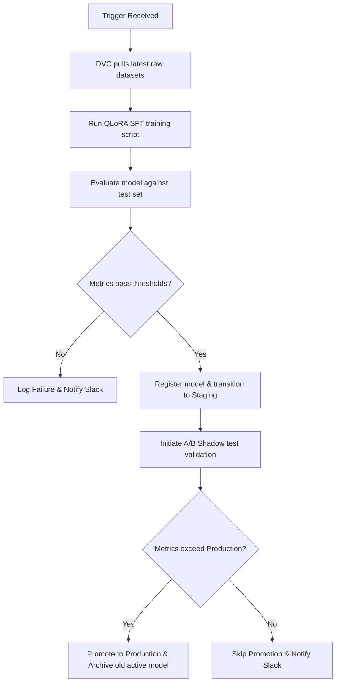

# IDIP MLOps Subsystem

Welcome to the MLOps engineering module of the Intelligent Document Intelligence Platform (IDIP). This subsystem coordinates experiment tracking, model registration, data versioning control, and automated retraining pipelines.

---

## 1. Experiment Tracking (`tracking.py`)

IDIP uses **MLflow** for experiment tracking, artifact storage, and model registry management.

### Usage: Context Manager
Track runs and parameter metrics cleanly using the context manager interface:

```python
from mlops.tracking import ExperimentTracker

with ExperimentTracker(experiment_name="idip-classifier") as tracker:
    tracker.log_params({"epochs": 10, "lr": 1e-4})
    # During training loops
    tracker.log_metrics({"loss": 0.04, "accuracy": 0.96}, step=epoch)
    # Log local files (e.g. weights, reports)
    tracker.log_artifact("reports/confusion_matrix.png")
```

### Model Version Promotion Rules
When logging model versions using `ExperimentTracker.log_model_version`, the subsystem registers the model in the MLflow Model Registry, infers its signature dynamically, tags it with environment variables (e.g. `git_sha`, `training_dataset_version`, `base_model`, `environment`), and automatically transitions it to **Staging** if it satisfies the following quality gate thresholds:

*   **Classifier models**: F1-Score $> 0.85$ (key: `f1` or `classifier_f1`)
*   **RAG pipeline models**: ROUGE-L $> 0.40$ (key: `rouge_l`, `rag_rouge_l`, or `ROUGE-L`)
*   **Hallucination validation**: Hallucination Rate $< 0.05$ (key: `hallucination_rate`)

---

## 2. Data Version Control (`data_versioning.py`)

IDIP integrates with **DVC** to track, push, and version raw datasets without overloading Git histories.

### Storage Configuration
*   **Tracked Directory**: `data/raw/`
*   **Remote Storage**: AWS S3 bucket: `s3://idip-dvc-store`
*   **SCM Compatibility**: Configured to run with `--no-scm` fallbacks when executing in Git-less environments.

### Automation Trigger
When ingestion tasks execute, `auto_version_on_batch` monitors the number of incoming documents. If a batch contains **more than 1000 items**, the data versioning utility:
1.  Stages files to DVC (`dvc add data/raw`).
2.  Pushes vectors to remote S3 (`dvc push`).
3.  Assigns a semantic tag formatting `v{major}.{minor}.{patch}-{environment}` stored under `data/versions.json` registry.

---

## 3. Retraining Scheduler (`retraining.py`)

The automated retraining pipeline coordinates model refreshes dynamically to counter data and concept drift.

### Trigger Sources
1.  **Drift Score Trigger**: Triggered when feature drift (e.g. PSI) $> 0.15$ (`DRIFT_ALERT_THRESHOLD`).
2.  **Weekly Retraining**: Chron job scheduled every Sunday at 2:00 AM UTC.
3.  **Labeled Data Trigger**: Triggered when more than 500 new labeled examples accumulate in the database.
4.  **Administrative Manual Trigger**: Triggered via `POST /v1/admin/retrain` endpoint.

### Training Pipeline Execution Flow


### Admin Endpoints
To trigger administrative runs manually:
*   **Endpoint**: `POST /v1/admin/retrain`
*   **Header Required**: `X-Admin-Key: super-admin-secret-key`
*   **Payload (Optional)**: `?trigger_source=manual_admin_override`
